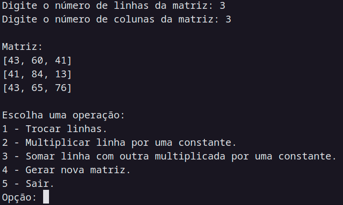
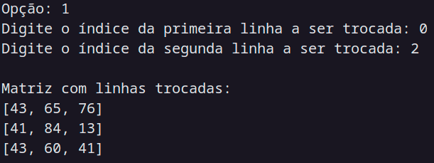
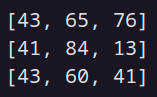
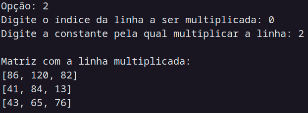
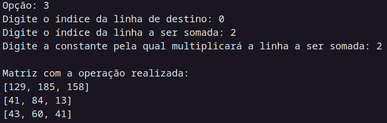

## Modelagem em prog matemática
Samuel Duarte Fernandes Lima ∴ - 2216976

## Introdução

* As matrizes serão geradas automaticamente, bastando apenas informar o tamanho de linhas e colunas.

```python
def generate_random_matrix(rows, cols):
    if (rows < 0 or cols < 0) or (rows == 1 or cols == 1):
        return 'Valores invalidos'
    
    matrix = []
    for i in range(rows):
        row = [random.randint(0, 100) for _ in range(cols)]
        matrix.append(row)
    return matrix
```
### Início do programa




Opção 01:

```python
def swap_rows(matrix, row_index_1, row_index_2):
    if row_index_1 < 0 or row_index_2 >= len(matrix):
        return 'Índice inválido'
    
    result = deepcopy(matrix)
    result[row_index_1], result[row_index_2] = result[row_index_2], result[row_index_1]
    return result
```





Opção 02:

```python
def times(matrix, row_index, constant):
    if row_index < 0 or row_index >= len(matrix):
        return 'Indices invalidos'
    
    result = deepcopy(matrix)
    for i, row in enumerate(matrix):
        if i == row_index:
            result[i] = [element * constant for element in row]

    return result
```




Opção 03:

```python
def sum_rows(matrix, target_row_index, source_row_index, constant):
    if target_row_index < 0 or target_row_index >= len(matrix) or source_row_index < 0 or source_row_index >= len(matrix):
        return 'Índice inválido'
    
    result = deepcopy(matrix)
    source_row = times(matrix, source_row_index, constant)[source_row_index]
    result[target_row_index] = [sum(pair) for pair in zip(result[target_row_index], source_row)]
    
    return result
```




